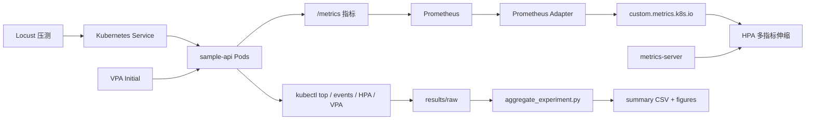

# 系统检查与答辩学习计划

## 1. 项目一句话

本系统研究 Kubernetes 场景下微服务弹性伸缩策略，通过静态副本、CPU-HPA、多指标 HPA、HPA+VPA 四组实验，对比延迟、吞吐、失败率、资源利用率、伸缩稳定性和成本代理指标。

答辩时不要说成“完整业务管理系统”，应明确说成“微服务弹性伸缩实验与评估系统”。

## 2. 系统检查结论

项目已经具备一般毕业设计系统检查所需的完整性：

- 有 README 和复现步骤。
- 有可部署的微服务代码和 Dockerfile。
- 有 Kubernetes 部署清单、HPA/VPA 策略和监控配置。
- 有 Locust 压测脚本和自动化实验脚本。
- 有四组策略各 3 次正式实验数据，共 12 条记录。
- 有汇总 CSV、结果图表、论文终稿和答辩 PPT。

主要风险：

- 现场复现实验依赖 Kubernetes、Minikube、Docker、VPA、Prometheus 等环境，不能临时才搭。
- 你需要熟悉每个目录的作用，避免老师一问入口就卡住。
- 结果数值会受机器环境影响，答辩时要强调“流程可重跑、数据可追溯、趋势可复现”。

## 3. 系统架构图

## 4. 七天学习路线

第 1 天：背熟项目一句话，能在 30 秒内讲清项目定位、研究对象和对比策略。

第 2 天：看懂目录和入口。重点掌握：

- `README.md`：复现流程。
- `services/sample-api/app.py`：示例微服务和 Prometheus 指标。
- `deploy/base/deployment.yaml`：Pod 资源请求、探针、镜像和副本。
- `loadtest/locust/locustfile.py`：负载路径和访问比例。
- `scripts/run_experiments.ps1`：自动化实验主入口。
- `results/aggregate_experiment.py`：数据汇总和质量校验。

第 3 天：讲清四组策略。

- `static`：固定 2 个副本，作为基线。
- `hpa_cpu`：按 CPU 利用率水平扩缩容。
- `hpa_multi`：CPU + Memory + QPS，多指标共同触发伸缩。
- `hpa_vpa`：HPA 管副本数，VPA Initial 管 Pod 创建时资源请求建议。

第 4 天：讲清实验流程。

部署服务 -> 安装 metrics-server -> 部署 Prometheus/Adapter -> 安装 VPA -> 运行 Locust -> 采集 HPA/VPA/events/top/CSV -> 汇总 CSV -> 生成图表 -> 写入论文结论。

第 5 天：背结果结论。

- `hpa_vpa` 在 burst 场景下 P95 延迟最低、QPS 最高、失败率最低。
- `static` 在突发负载下失败率和成本代理指标较高。
- 多指标策略比单 CPU 策略更能反映真实业务压力。

第 6 天：答辩问答演练。重点准备 Kubernetes、HPA、VPA、Prometheus Adapter、QPS 指标、实验重复次数和成本代理指标。

第 7 天：现场演示演练。按“README -> 部署 YAML -> HPA/VPA 策略 -> Locust 脚本 -> summary CSV -> figures -> 结论”的顺序讲 3 分钟。

## 5. 答辩表达模板

开场：

“我的毕业设计不是做一个普通业务系统，而是构建一套可复现实验平台，用来研究 Kubernetes 微服务在突发负载下的弹性伸缩策略。”

核心贡献：

“我完成了服务部署、监控采集、自定义指标暴露、自动化压测、结果汇总和图表生成，形成了从运行到论文数据的闭环。”

创新点：

“相比只看 CPU 的 HPA，我引入了 QPS 业务指标，并加入 VPA 的资源建议机制，用实验数据比较不同策略的性能、资源和稳定性表现。”

防守说法：

“本实验的目标是比较策略趋势，不追求跨机器逐点数值完全一致；因此我保留了 manifest、raw CSV、summary CSV 和图表，保证过程可追溯、趋势可复现。”

